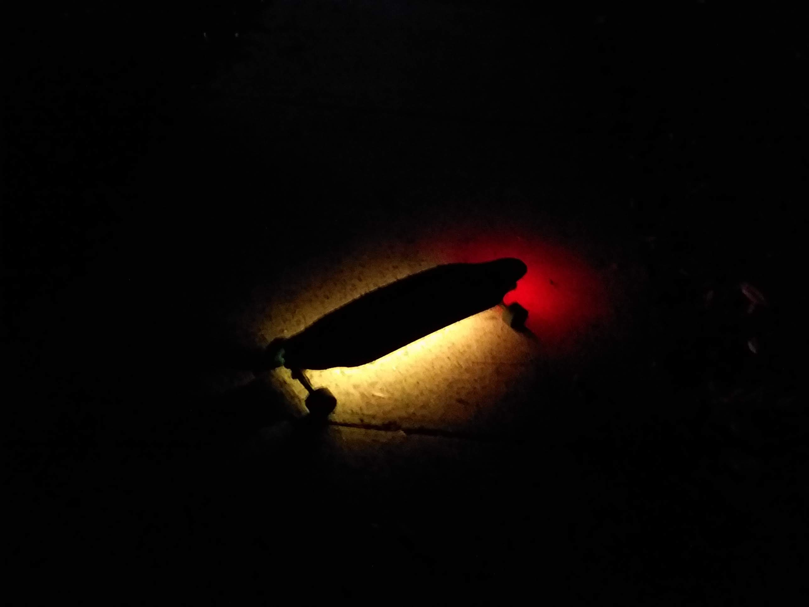

# BoardLights
cool underglow lights for night longboarding

built using an arduino pro micro and ws2812b light strip duct taped to the bottom of a longboard deck

<figure>
  
  <figcaption><i>pencil style</i></figcaption>
</figure>
